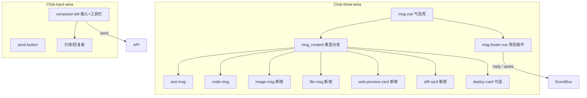

# Chat Area Skill（聊天区）

## 使用场景

当用户要求在 AgentHub 前端实现或维护**聊天内容区**或**输入区**时使用本 Skill，包括但不限于：

- 消息气泡结构（头像、名称、内容、时间、底部操作）。
- 多消息类型渲染与操作（文本、代码、图片、附件、网页预览、Diff、部署状态）。
- 每条消息下的回复、引用，以及代码/网页/PPT 预览入口。
- 输入框左右分栏布局重构。

与 `single-agent-chat` 的关系：该 Skill 聚焦**单条消息的展示与交互**；会话列表、单 Agent 会话见 `single-agent-chat`。与 `left-sidebar-menu` 的关系：左侧导航见该 Skill，本 Skill 只改中间聊天区。

## 需求原文（verbatim）

聊天区：需求：

（1）聊天内容：

1. 气泡：1.1 头像，1.2 名称，消息：

1.1.1 消息类型：文本、代码块、图片、文件附件、网页预览卡片、Diff 视图卡片、部署状态卡片（可选）

1.1.2 消息操作：回复、引用、重新生成、复制代码、一键应用 Diff、展开预览。

1.1.3 每个消息气泡下都有回复和引用，生成多的文件代码和网页代码及 ppt 的预览按钮；

1.3 时间

（2）输入框：左右结构：左边：输入文字在上，按钮在下（表情，文件，打电话，视频）；右边：发送按钮

## 项目上下文

Vue 3 + TypeScript + Pinia + Element Plus。优先小步扩展，不重写聊天主流程。

| 职责 | 现有文件 |
|------|----------|
| 消息列表容器 | `src/veiws/Chat-show-area.vue` |
| 单条气泡外壳（头像、名称、时间） | `src/veiws/message-content/msg.vue` |
| 内容分发 + 悬停菜单 | `src/veiws/message-content/msg_content .vue` |
| 各类型子组件 | `text-msg.vue`、`code-msg.vue`、`emoji-msg.vue`、`callMsg.vue` |
| 输入区 | `src/veiws/Chat-input-area.vue` |
| 旧消息契约 | `src/types/message.ts`、`src/types/messageType.ts` |
| 新 AgentHub 契约 | `src/types/agenthub.ts`（`ChatMessage`、`PreviewState` 等） |

**已有能力（保留，不破坏）**：文本/表情/通话/Code 类型、悬停引用/撤回/复制、`referenceMsg` 引用条、`TimeMsg` 时间、`targetId === '1'` 群聊判断。

## 实现方案总览



分三期落地，每期可独立验收：

| 阶段 | 范围 | 产出 |
|------|------|------|
| P0 | 气泡壳 + 底部常驻操作 + 输入区布局 | `msg-footer.vue`、输入区 CSS 重构 |
| P1 | 核心消息类型 | `image` / `file` / 强化 `code` |
| P2 | 卡片类 + 高级操作 | 网页/Diff/部署卡片、重新生成、应用 Diff、展开预览 |

---

## （1）聊天内容实现

### 1.1 气泡结构

在 `msg.vue` 保持现有层级，**新增底部操作区**，与悬停 `msg-menu` 并存：

```
msg-box
├── time-msg（isShowTime 时）
└── msg-box-wrapper
    ├── Avatar
    └── msg-box-info
        ├── 用户名 + 角色标签
        ├── msg_content（气泡主体）
        └── msg-footer（新增，每条消息常驻）
```

`msg-footer.vue` 职责：

- 左侧：**回复**、**引用**（需求 1.1.3，每条消息都有，不依赖 hover）。
- 右侧：按 `message` 载荷动态显示 **预览** 按钮（`code` / `web` / `ppt` / `file`）。
- 通过 `EventBus` 或 `useChatMsgStore` 与输入区联动（与现有 `setReferenceMsg` 一致）。

### 1.1.1 消息类型

在 `src/types/messageType.ts` 扩展（字符串常量，与后端对齐前可 mock）：

```ts
export const MessageType = {
  Text: 'text',
  Recall: 'recall',
  Emoji: 'emoji',
  Call: 'call',
  Code: 'code',
  Image: 'image',       // 新增
  File: 'file',           // 新增
  WebPreview: 'web',      // 网页预览卡片
  Diff: 'diff',           // Diff 视图卡片
  Deploy: 'deploy',       // 部署状态卡片（可选）
}
```

`message` 字段在后端未结构化前继续用 **JSON 字符串**；在 `src/types/message.ts` 增加 payload 接口（与 `agenthub.ts` 的 `MessageCodeArtifact` 等对齐命名）：

| type | Payload 要点 |
|------|----------------|
| `text` | 现有 `MessageContent[]` JSON |
| `code` | `{ language, filename?, content }`（已有） |
| `image` | `{ url, width?, height?, alt? }` |
| `file` | `{ fileName, fileSize?, fileType?, downloadUrl? }` |
| `web` | `{ title, url, description?, ogImage? }` |
| `diff` | `{ fileName, language?, hunks[], baseRef?, headRef? }` |
| `deploy` | `{ status: pending\|success\|failed, env?, url?, logsUrl? }` |

在 `msg_content .vue` 为每种 `MessageType` 增加独立 `v-if` 分支；**一种类型一个 `.vue` 文件**，不把逻辑堆进 `text-msg.vue`。

推荐新增组件：

- `image-msg.vue`：限高 + 点击灯箱预览。
- `file-msg.vue`：图标 + 文件名 + 大小 + 下载。
- `web-preview-card.vue`：标题、描述、域名、favicon；「展开预览」打开侧栏或全屏 iframe（复用 `PreviewState`，见 `agenthub.ts`）。
- `diff-card.vue`：行级着色（增绿删红）；「一键应用 Diff」emit `apply-diff`，由父级或 store 调后端/本地 patch。
- `deploy-status-card.vue`（可选）：状态色条 + 环境 + 链接。

解析失败时降级为纯文本，**不得白屏**。

### 1.1.2 消息操作

| 操作 | 展示位置 | 行为 |
|------|----------|------|
| 回复 | `msg-footer` 常驻 | 设置 `replyTo`（`ComposerDraft.replyTo`），输入区顶部显示回复条 |
| 引用 | `msg-footer` 常驻 + 悬停菜单保留 | 沿用 `msgStore.setReferenceMsg` |
| 重新生成 | 仅 Agent 消息、悬停或 footer | `POST` 或 EventBus `regenerate-message`，带 `messageId` |
| 复制代码 | `code-msg` 头部 | 已有，保留 |
| 一键应用 Diff | `diff-card` | emit → 确认弹窗 → 调 API 或本地应用 |
| 展开预览 | `web` / 多文件产物 | 更新 `PreviewState`，右侧预览面板或 Modal |

悬停 `msg-menu`（`msg_content .vue`）保留引用/撤回/复制；**新增**重新生成（Agent）、应用 Diff（diff 类型）、展开预览（web/file）。

### 1.1.3 预览按钮规则

`msg-footer` 根据解析后的 payload 显示按钮（无载荷不显示）：

| 条件 | 按钮文案 | `PreviewState.type` |
|------|----------|---------------------|
| `type === code` 或 `codeArtifact` | 预览代码 | `code` |
| `type === web` 或 `previewArtifact.url` 且非 ppt | 预览网页 | `web` |
| ppt 扩展名或 `previewType === 'ppt'` | 预览 PPT | `ppt` |
| `type === file` 或可预览文件 | 预览文件 | `file` |

点击后向 `zhu.vue` 或专用 `usePreviewStore` 写入 `PreviewState`，由预览面板组件渲染（若无面板则先用 `ElDialog` + iframe / `vue-office` 等，后端未就绪用 mock URL）。

### 1.3 时间

- 继续使用 `TimeMsg.vue`，由 `MessageRecord.isShowTime` 控制（与列表逻辑一致）。
- 可选增强：非首条消息在 `msg-footer` 右侧显示 `HH:mm` 浅色小字（不替代 `isShowTime` 分组逻辑）。

---

## （2）输入框实现

### 目标布局

```
┌─────────────────────────────────────────────┬────────┐
│  [引用/回复条 - 有则显示]                    │        │
│  ┌─────────────────────────────────────┐   │        │
│  │ 多行输入（上）                        │   │ 发送 │
│  └─────────────────────────────────────┘   │  ➤   │
│  [表情] [文件] [语音] [视频]  （下）         │        │
└─────────────────────────────────────────────┴────────┘
```

### 改动要点（`Chat-input-area.vue`）

1. 根节点改为 `display: flex; flex-direction: row; align-items: flex-end; gap: 12px;`。
2. **左侧** `.composer-left`：`flex: 1; display: flex; flex-direction: column;`。
   - 上：`.composer-input` 包裹现有 `Input` 组件。
   - 下：`.composer-toolbar` 水平排列工具按钮（44×44 圆角，hover `#f0f0f0`）。
3. **右侧** `.publish-button` 固定宽高，垂直与左侧底对齐。
4. 表情面板 `position: absolute` 相对 `.composer-left` 定位在工具栏上方。
5. 工具栏行为：
   - **表情**：现有 `showEmoji` / `insertEmoji`。
   - **文件**：`<input type="file" hidden>` + `emit('sendFile')` 或走上传 API。
   - **打电话 / 视频**：复用现有 `call` emit 与 `MessageType.Call`。
6. **回复条**：除 `referenceMsg` 外增加 `replyTo` 条（文案「回复 xxx: …」），关闭时清空 store。

样式延续：白底 `#ffffff`、浅灰边框 `#f0f0f0`、文字 `#262626` / `#737373`、主按钮 `#1a1a1a`。

---

## 推荐改动路径（按文件）

1. `src/types/messageType.ts` — 新增类型常量。
2. `src/types/message.ts` — 新增各 Payload 接口；`MessageRecord` 可增加可选 `replyToId`、`artifacts`（或继续 JSON 塞入 `message`）。
3. `src/veiws/message-content/msg-footer.vue` — 新建。
4. `src/veiws/message-content/msg.vue` — 挂载 `msg-footer`。
5. `src/veiws/message-content/msg_content .vue` — 新类型分支 + 扩展悬停菜单。
6. `src/veiws/message-content/*-msg.vue` / `*-card.vue` — 各类型 UI。
7. `src/veiws/Chat-input-area.vue` — 左右布局 + 工具栏 + 回复条。
8. `src/store/module/useMessageStore .ts` — `replyTo` 状态（若不用 `agenthub` 的 `ComposerDraft`）。
9. `src/veiws/Chat-show-area.vue` — mock 各类型一条消息便于联调。
10. （可选）`src/components/zhu.vue` — 预览侧栏容器。

## 不允许破坏的现有功能

- 不删除现有消息组件；不删除群聊入口。
- 不改变 `targetId === '1'` 表示群聊。
- 不把私聊全部改成 Agent 会话。
- 后端契约未确认时：mock JSON + 本地 EventBus，不阻塞 UI。
- 不删除文件；确需删除须先征得用户同意。

## 验收清单

- [ ] 每条消息气泡含头像、名称、内容区。
- [ ] 每条消息气泡**下方常驻**回复、引用按钮。
- [ ] 文本、代码块可渲染；图片、附件、网页卡片、Diff 卡片有 mock 可验证。
- [ ] 部署状态卡片为可选，未实现时不影响其它类型。
- [ ] 代码消息可复制；Diff 可触发「应用」流程（mock 亦可）；网页/文件/PPT 有预览按钮且能打开预览 UI。
- [ ] Agent 消息支持重新生成入口。
- [ ] 时间：`isShowTime` 时分组标题仍正常。
- [ ] 输入区：左输入上、工具下；右发送；表情/文件/语音/视频可用。
- [ ] 群聊、私聊、原有引用/撤回/通话不受影响。

## 中文注释规范

- 文档与用户说明使用中文。
- 代码注释只写非显而易见的业务约束。
- 不写无意义的「定义变量」「调用函数」类注释。

## 附加参考

- 类型与预览状态细节见 [reference.md](reference.md)
- 单 Agent / code 消息专项见 `.cursor/skills/single-agent-chat/SKILL.md`
