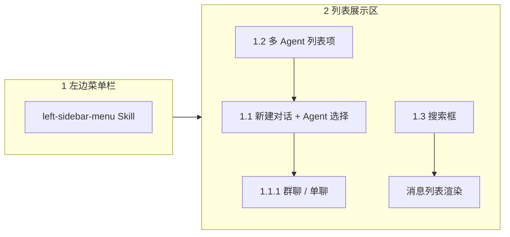

# Left Sidebar Skill（左边框）

## 使用场景

当用户要求在 AgentHub 前端实现或维护**整个左边框**时使用本 Skill，包括：

- 左侧菜单栏（头像、消息/Agent 入口、用户弹框等）。
- 列表展示区：消息列表、新建对话、群聊与单聊、多 Agent、搜索框。

**技能分工**（避免重复实现）：

| 范围 | 使用 Skill |
|------|------------|
| （1）左边菜单栏 | [left-sidebar-menu](../left-sidebar-menu/SKILL.md) |
| （2）列表展示区 | 本 Skill |
| 单 Agent 会话列表增强（置顶/归档/排序细节） | [single-agent-chat](../single-agent-chat/SKILL.md) |
| 中间聊天区气泡与输入 | [chat-area](../chat-area/SKILL.md) |

实现菜单栏相关需求时，**先阅读并遵循** `left-sidebar-menu`，本 Skill 只补充列表区与跨面板联动。

## 需求原文（verbatim）

左边框：（1）左边菜单栏 ：参考left-sidebar-menu.skill（2）列表展示区：1.消息列表：1.1- 新建对话：创建一个新的聊天会话，选择或指定要对话的 Agent（如 Claude Code、Codex、OpenCode 等），1.1.1对话：群聊（多个agent和用户）和单聊（自己和选择创建的agent）；1.2  - 多 Agent 接入：至少接入两个主流 Agent 平台，如 Cloud Code、Codex 或 Open Code，支持用户自建 Agent，每个 Agent 在聊天列表有联系人头像、名称和能力标签。1.3 搜索框

## 项目上下文

Vue 3 + TypeScript + Pinia + Element Plus。左边框主文件：

| 职责 | 文件 |
|------|------|
| 左边框布局、列表区、新建/搜索 | `src/components/zhu.vue` |
| 类型 | `src/types/agenthub.ts`（`SidebarPanel`、`SidebarAgent`、`ConversationMode` 等） |
| 搜索组件 | `src/components/Search.vue`（或项目内 `Search` 引用） |
| 列表项预览 | `src/veiws/message-content/chat-list-msg-content.vue` |

已有实现（扩展而非重写）：

- `activeSidebarPanel`：`messages` | `agents`，与菜单互斥切换。
- 消息面板：群聊项（`targetId === '1'`）、私聊列表、`agentConversations` 单 Agent 会话区。
- Agent 面板：`sidebarAgents` + 头像/名称/能力标签。
- 搜索：`userSearchValue` + `Search` 组件，按面板切换 placeholder。
- 新建：`onCreateAgentConversation` / `onSelectSidebarAgent`（当前偏 mock，需对齐 1.1 选型流程）。

## 实现目标总览



### （1）左边菜单栏

按 `left-sidebar-menu` 执行，本 Skill 仅要求：

- 消息列表按钮 → `activeSidebarPanel = 'messages'`，内容区只显示列表展示区（本 Skill）。
- Agent 列表按钮 → `activeSidebarPanel = 'agents'`，内容区只显示 Agent 目录（为 1.2 提供选型来源）。
- 两面板互斥，不与列表区重复实现用户弹框逻辑。

### （2）列表展示区 · 1. 消息列表

消息列表面板标题建议为「消息列表」，在 `activeSidebarPanel === 'messages'` 时渲染。

列表分区建议（自上而下）：

1. **工具行**：搜索框（1.3）+ 新建对话入口（1.1）。
2. **Agent 会话区**：单聊 Agent 会话（1.1.1 单聊）。
3. **群聊入口**：固定群聊项（1.1.1 群聊，`targetId === '1'`）。
4. **用户私聊区**：已有 `privateChatList`（人与人在线聊天，与 Agent 单聊区分）。

#### 1.1 新建对话

创建新的聊天会话，**必须让用户选择或指定 Agent**，而不是静默使用默认 Agent。

推荐交互（后端未就绪时可用前端 mock）：

1. 点击「新建对话」打开弹窗/抽屉（可替换现有仅文案为「新建 Agent」的按钮）。
2. 弹窗内：
   - **会话类型**（对应 1.1.1）：`单聊` | `群聊`。
   - **Agent 选择**：从 `sidebarAgents` 多选（群聊）或单选（单聊）；支持「自建 Agent」入口（跳转 Agent 面板或简易表单，写入 `sidebarAgents`）。
   - **可选标题**：单聊默认 `{Agent名} 对话`，群聊默认 `多 Agent 协作`。
3. 确认后：
   - **单聊**：创建 `conversationType: 'single-agent'` 记录，`agentId`/`agentName` 绑定所选 Agent，调用 `onSelectAgentConversation`。
   - **群聊**：创建 `conversationType: 'group'` 记录（新 id，**不要**占用 `targetId === '1'` 除非产品明确要求合并）；`participantAgentIds` 存所选 Agent；选中后 `targetId` 指向新群会话。若短期仅保留 legacy 群聊，则在 UI 标注「默认群聊」与「新建多 Agent 群」的区别。

与 Agent 面板的联动：在 Agent 面板点击某 Agent 时，若已有该 Agent 的单聊会话则选中，否则按 1.1 单聊规则创建（现有 `onSelectSidebarAgent` 逻辑可复用）。

#### 1.1.1 对话：群聊与单聊

| 类型 | 参与者 | 列表展示 | 选中标识 |
|------|--------|----------|----------|
| 群聊 | 多个 Agent + 用户 | 群头像/叠字头像、群名称、最后一条消息预览 | 独立 `targetId`；保留现有 `targetId === '1'` 为默认群聊 |
| 单聊 | 用户 + 一个所选 Agent | Agent 头像、会话标题、能力标签（可选缩略）、最后消息 | `agentConversations` 或后端 `ConversationItem` |

约束：

- **不改变** `targetId === '1'` 表示默认群聊的现有判断（见 `left-sidebar-menu` / `single-agent-chat`）。
- 群聊与单聊在列表中有明显分区或标签（如 `群聊` / `Agent`）。
- 单聊项展示 Agent **头像、名称**；能力标签可在副标题或 hover 展示，避免挤占主标题。

#### 1.2 多 Agent 接入

至少接入 **两个** 主流 Agent 平台（需求原文示例：Cloud Code、Codex、Open Code；实现时与产品对齐命名，代码库已有 Claude Code、ChatGPT 等等价 mock）。

要求：

- **平台 Agent**：`sidebarAgents` 中至少 2 条不同平台/能力画像（如 Claude Code、Codex、OpenCode）。
- **用户自建 Agent**：支持新增到 `sidebarAgents`（本地 state 或后续 API）；字段含 `id`、`name`、`avatar`、`capabilityTags`、`description?`、`platform?`。
- **聊天列表中的 Agent 呈现**（消息列表 + Agent 面板一致）：
  - 联系人式 **头像**（空则首字母占位）。
  - **名称**。
  - **能力标签**（最多展示 3～4 个，超出 `+N`，复用 `getVisibleCapabilityTags`）。

Agent 面板（`activeSidebarPanel === 'agents'`）用于浏览与选型；消息列表中的会话行用于活跃对话管理（置顶/归档/未读等可沿用 `single-agent-chat`）。

#### 1.3 搜索框

- 位置：列表顶部工具行，与新建对话同一行或紧邻（现有 `.search` + `Search` 组件）。
- **消息面板** placeholder：`搜索用户/会话`（或产品文案）；过滤：
  - Agent 会话：`title`、`agentName`、`lastMessage`。
  - 群聊/私聊：`targetInfo.name`、最后消息摘要。
- **Agent 面板** placeholder：`搜索 Agent`；过滤 `name`、`description`、`capabilityTags`。
- 切换 `activeSidebarPanel` 时保留或清空关键词由产品决定；默认 **保留关键词** 但切换过滤字段（当前 `userSearchValue` 共用即可）。
- 无结果时展示空状态文案，不留白屏。

## 推荐数据模型

在 `agenthub.ts` 逐步收敛类型，mock 阶段可在 `zhu.vue` 内联：

```ts
type AgentPlatform = 'claude-code' | 'codex' | 'opencode' | 'custom'

interface SidebarAgent {
  id: string
  name: string
  avatar: string
  capabilityTags: string[]
  description?: string
  platform?: AgentPlatform
  isCustom?: boolean
}

type ConversationKind = 'legacy-group' | 'group' | 'single-agent' | 'private'

interface AgentConversation {
  id: string
  title: string
  conversationType: ConversationKind
  agentId?: string
  agentName?: string
  participantAgentIds?: string[]
  lastMessage: string
  lastActiveAt: string
  isPinned: boolean
  isArchived: boolean
}
```

约定：

- `legacy-group`：对应 `targetId === '1'`。
- 新建群聊使用新 id，避免破坏群聊判断。
- `platform` 用于筛选与平台图标（可选二期）。

## 推荐改动路径

1. 阅读 `left-sidebar-menu`，确认菜单与 `activeSidebarPanel` 已就绪。
2. 在 `zhu.vue` 将「新建 Agent」改为「新建对话」，接入 Agent 选择 + 单聊/群聊类型（弹窗）。
3. 扩充 `sidebarAgents` mock：至少 Claude Code、Codex/OpenCode 两类 + 一条 `isCustom` 示例。
4. 实现「添加自建 Agent」最小表单（名称 + 标签），追加到 `sidebarAgents`。
5. 扩展 `AgentConversation` 支持 `group` 与 `participantAgentIds`；列表增加群聊分区渲染。
6. 统一搜索过滤函数（消息列表一条 computed，Agent 列表一条 computed）。
7. 后端契约确认后，将 mock 创建/列表替换为 API，保持 UI 字段不变。

## 交互与样式

- 列表行：hover、active、`未读` 角标（沿用 `dot_hint`）。
- 新建对话弹窗：取消/确认；确认前校验至少选一个 Agent。
- 群聊行：显示参与 Agent 数量或头像堆叠（可选）。
- 样式延续白/浅灰/深灰与现有 `.chat-list-item`、`.agent-list-item`。
- 不删除现有组件；不移除群聊入口与私聊 API 流程。

## 不允许破坏的现有功能

- `targetId === '1'` 仍为默认群聊。
- 不删除 `Chat-show-area`、`Chat-input-area` 及已有消息类型。
- 不修改已确认的后端接口语义。
- 不删除文件；删除前须征得用户同意。

## 验收清单

### 菜单栏（委托 left-sidebar-menu）

- [ ] 头像、消息列表、Agent 列表三入口可用，面板互斥。

### 列表展示区

- [ ] 消息面板显示搜索框，能过滤会话与 Agent 会话行。
- [ ] Agent 面板显示搜索框，能过滤 Agent 名称与能力标签。
- [ ] 「新建对话」可选择 Agent（至少展示 2+ 平台 Agent + 自建入口）。
- [ ] 可创建单聊（用户 + 所选 Agent）并在列表中选中。
- [ ] 群聊与单聊在列表可区分；默认群聊（`targetId === '1'`）仍可用。
- [ ] 多 Agent：列表/面板中每个 Agent 有头像、名称、能力标签。
- [ ] 自建 Agent 可加入列表并用于新建单聊。
- [ ] 选中会话后中间聊天区标题与 `targetId` 逻辑正确。
- [ ] 原有私聊、置顶、归档、最近活跃排序仍可用（见 single-agent-chat）。

## 中文注释规范

- 文档与用户说明使用中文。
- 代码注释只写非显而易见的业务约束（如「新建群聊不得使用 id=1」）。
- 不写无意义的流程注释。
