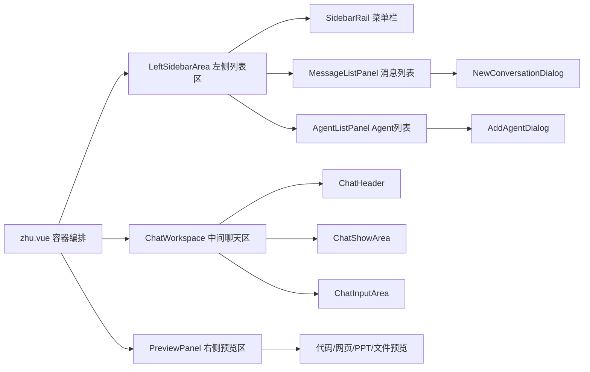

# Zhu Component Split Skill

## 使用场景

当用户要求对 `src/components/zhu.vue` 做以下工作时使用本 Skill：

- 拆分 `zhu.vue` 超大单文件组件。
- 将页面按**左边列表区、中间聊天区、右边预览区**拆成独立组件。
- 识别可复用 UI 区块与业务逻辑，并按职责分离。
- 保证拆分后会话列表、Agent 列表、用户弹框、聊天展示、输入框、预览区、WebSocket 与 Pinia 状态仍然联通。
- 为后续维护、新增功能或局部复用建立清晰组件边界。

## 需求原文（verbatim）

帮我把@zhu.vue的 文件  拆分为组件，左边为列表区，中间为聊天区，右边为预览区，识别独立的UI区块与逻辑，按功能或复用性进行分离，要保证每个功能联通，组件之间通信。可以向我提问确定需求。

## 项目上下文

当前项目是 Vue 3 + TypeScript + Pinia + Element Plus。优先小步迁移，不重写业务。

| 职责 | 当前/相关文件 |
|------|---------------|
| 主布局、左侧列表、聊天区入口 | `src/components/zhu.vue` |
| 用户资料弹窗 | `src/components/UserProfileDialog.vue` |
| 连接状态 | `src/components/ConnectionStatus.vue` |
| 聊天展示区 | `src/veiws/Chat-show-area.vue` |
| 聊天输入区 | `src/veiws/Chat-input-area.vue` |
| 搜索组件 | `src/veiws/Serach.vue` |
| 头像组件 | `src/veiws/img/avatar.vue` |
| 会话 Store | `src/store/module/useSessionStore` |
| 用户 Store | `src/store/module/useUserStore` |
| Agent Store | `src/store/index` |
| 类型 | `src/types/agenthub.ts` |
| WebSocket | `src/utils/ws-client` |

同时遵循：

- `left-sidebar`：左侧列表区、消息列表、Agent 列表、新建对话、多 Agent。
- `left-sidebar-menu`：左侧菜单栏、头像、用户弹框、消息/Agent 面板互斥。
- `single-agent-chat`：单 Agent 会话、置顶、归档、搜索、最近活跃排序。
- `chat-area`：聊天展示区、输入区、多消息类型、预览联动。

## 拆分总览

目标结构：



`zhu.vue` 最终只保留：

1. 三栏布局编排。
2. 顶层状态协调，例如移动端侧栏开关、当前预览状态。
3. 与全局 Store / WebSocket 的跨区域 orchestration。
4. 不再直接承载大段列表 DOM、Agent DOM、弹窗 DOM 或聊天 DOM。

## 推荐目录结构

优先放在 `src/components/zhu/` 下，避免污染全局组件目录：

```text
src/components/zhu/
├── LeftSidebarArea.vue
├── SidebarRail.vue
├── MessageListPanel.vue
├── AgentConversationList.vue
├── GroupConversationList.vue
├── AgentListPanel.vue
├── NewConversationDialog.vue
├── AddAgentDialog.vue
├── ChatWorkspace.vue
├── ChatHeader.vue
├── PreviewPanel.vue
└── composables/
    ├── useSidebarAgents.ts
    ├── useConversationActions.ts
    └── usePreviewState.ts
```

可按实际代码量调整：如果某组件不足 80 行且只被一个父组件使用，可先内联在父组件内，避免过度拆分。

## 组件职责边界

### `zhu.vue`：页面容器

保留职责：

- 引入 `useSessionStore`、`useUserInfoStore`、`wsClient` 等全局依赖。
- 维护跨区域状态：`showLeft`、`activeSidebarPanel`、`previewState`、`isSendLoading`。
- 处理跨区域动作：选择会话、创建会话后连接 WebSocket、发送消息、重试连接。
- 将数据和事件传给左/中/右三栏组件。

不应保留：

- 会话列表行 DOM。
- Agent 列表行 DOM。
- 新建会话弹窗 DOM。
- 添加 Agent 弹窗 DOM。
- 聊天头部与输入区布局 DOM。
- 预览卡片具体渲染 DOM。

### `LeftSidebarArea.vue`：左侧列表区总入口

职责：

- 渲染左侧 `<aside class="sidebar">`。
- 管理菜单栏与当前面板互斥展示。
- 组合 `SidebarRail`、`MessageListPanel`、`AgentListPanel`。
- 接收 `showLeft`、`activePanel`、用户信息、会话列表、Agent 列表。
- 向父组件 emit `update:showLeft`、`update:activePanel`、`select-session`、`create-session`、`select-agent`、`logout`、`edit-profile`。

### `SidebarRail.vue`：左侧菜单栏

职责：

- 头像按钮。
- 用户弹框入口。
- 消息列表按钮。
- Agent 列表按钮。
- 激活态展示。

建议通信：

- `props`: `currentUser`、`activePanel`、`showUserPopover`。
- `emits`: `update:activePanel`、`update:showUserPopover`、`edit-profile`、`logout`。

### `MessageListPanel.vue`：消息列表面板

职责：

- 标题、版本标识。
- 搜索框。
- 新建对话按钮。
- 显示/隐藏归档。
- 渲染 Agent 单聊区和群聊区。
- 空状态、加载态。

建议通信：

- `props`: `sessions`、`currentSessionId`、`isLoading`、`agents`。
- 本地状态：`searchValue`、`showArchived`，或由父组件通过 `v-model` 管理。
- `emits`: `select-session`、`new-session`、`toggle-pin`、`toggle-archive`。

### `AgentConversationList.vue` / `GroupConversationList.vue`

当列表行模板较长时继续拆分：

- `AgentConversationList` 负责单 Agent 会话列表、能力标签、置顶/归档按钮。
- `GroupConversationList` 负责群聊列表，保留默认群聊与多 Agent 群聊区分。
- 两者只做展示与事件上抛，不直接访问 Store。

### `AgentListPanel.vue`

职责：

- Agent 搜索。
- 添加自建 Agent 按钮。
- Agent 列表项：头像、名称、描述、能力标签。
- 选中态。

建议通信：

- `props`: `agents`、`selectedAgentId`。
- `emits`: `select-agent`、`add-agent`。

### `NewConversationDialog.vue`

职责：

- 新建对话表单。
- 单聊/群聊选择。
- Agent 单选/多选。
- 标题输入。
- 表单校验。

建议通信：

- `props`: `modelValue`、`agents`、`initialAgentId?`。
- `emits`: `update:modelValue`、`confirm`、`go-agent-panel`。
- `confirm` payload 建议：

```ts
interface CreateConversationPayload {
  mode: 'single' | 'group'
  title: string
  agentId?: string
  participantAgentIds?: string[]
}
```

### `AddAgentDialog.vue`

职责：

- 自建 Agent 表单。
- 名称、能力标签、简介。
- 基础校验。

建议通信：

- `props`: `modelValue`。
- `emits`: `update:modelValue`、`confirm`。
- `confirm` payload 建议：

```ts
interface AddAgentPayload {
  name: string
  capabilityTags: string[]
  description?: string
}
```

### `ChatWorkspace.vue`：中间聊天区

职责：

- 聊天头部。
- 连接状态展示。
- `ChatShowArea`。
- `ChatInputArea`。
- 移动端打开左侧栏按钮。

建议通信：

- `props`: `currentSession`、`connectionState`、`reconnectAttempt`、`isLoadingMessages`、`isSendLoading`。
- `emits`: `open-left`、`send`、`retry`、`preview`。

### `ChatHeader.vue`

当头部逻辑较多时从 `ChatWorkspace` 拆出：

- 展示群聊/单聊标签。
- 展示标题、创建时间。
- 展示 `ConnectionStatus`。
- 不直接访问 Store。

### `PreviewPanel.vue`：右侧预览区

职责：

- 替换当前空白 `blank-panel`。
- 渲染代码、网页、PPT、文件、Diff、部署状态等预览。
- 支持关闭、展开、空状态。

建议通信：

- `props`: `previewState`。
- `emits`: `close`、`apply-diff`、`open-external`。

`PreviewState` 可优先使用 `src/types/agenthub.ts` 中已有类型；缺失时补充最小类型。

## 逻辑抽离建议

### `useSidebarAgents.ts`

抽离内容：

- `sidebarAgents` mock 或 Store 数据适配。
- `filteredAgentList`。
- `getVisibleCapabilityTags`。
- `getAgentAvatarStyle`。
- `getAgentPlatformLabel` / `formatPlatformLabel`。
- `handleAddCustomAgent` 的纯数据部分。

### `useConversationActions.ts`

抽离内容：

- `selectSession`。
- `createConversation`。
- `togglePin`。
- `toggleArchive`。
- `restoreCurrentSession`。
- WebSocket connect/disconnect 的统一封装。

注意：WebSocket 与 Store 变更属于业务副作用，集中在该 composable 或父容器，不下沉到纯 UI 列表项。

### `usePreviewState.ts`

抽离内容：

- 当前预览对象。
- 打开代码/网页/PPT/文件预览。
- 关闭预览。
- 可选：预览历史或展开状态。

## 组件通信原则

1. **跨区域共享状态用 Pinia 或父容器协调**：当前会话、消息、用户信息、连接状态不要在子组件重复维护。
2. **展示组件只用 props/emits**：列表项、头部、弹窗不直接改 Store。
3. **表单组件 emit payload**：新建会话、自建 Agent 表单只返回结构化数据，由父级决定调用 Store/API。
4. **WebSocket 只在容器层或 composable 层操作**：避免多个子组件重复 connect/disconnect。
5. **双向绑定只用于 UI 开关**：如 `v-model:showLeft`、`v-model:activePanel`、`v-model` 弹窗显隐。
6. **避免事件穿透过深**：超过两层的常用动作优先使用 composable 或 Pinia action。

## 推荐迁移步骤

### 第 1 步：建立类型与目录

- 创建 `src/components/zhu/` 目录。
- 如 payload 类型可复用，优先补充到 `src/types/agenthub.ts`。
- 不删除 `zhu.vue` 中旧代码，先以复制迁移方式保证可回退。

### 第 2 步：拆中间聊天区

优先拆 `ChatWorkspace.vue`，因为它依赖较少：

- 移走 `chat-shell` 模板。
- 通过 props 传入当前会话、连接状态、loading。
- emit `send`、`retry`、`open-left`。
- 保持 `ChatShowArea`、`ChatInputArea` 原引用不变。

### 第 3 步：拆左侧总区和菜单栏

- 创建 `LeftSidebarArea.vue`。
- 从 `zhu.vue` 移入 `<aside class="sidebar">` 结构。
- 再拆 `SidebarRail.vue`。
- 确保 `activeSidebarPanel` 仍互斥控制消息与 Agent 面板。

### 第 4 步：拆消息列表与 Agent 列表

- 创建 `MessageListPanel.vue`。
- 创建 `AgentListPanel.vue`。
- 过滤、排序可先留在父组件；稳定后移到 composable。
- 列表项事件必须上抛：选择、置顶、归档、新建、添加 Agent。

### 第 5 步：拆弹窗

- 创建 `NewConversationDialog.vue`。
- 创建 `AddAgentDialog.vue`。
- 弹窗内部只做校验和 payload 组装，不直接调用 `sessionStore.createSession`。

### 第 6 步：补右侧预览区

- 创建 `PreviewPanel.vue` 替换 `blank-panel`。
- 初始可只实现空状态和关闭按钮。
- 后续接入 `chat-area` 的代码、网页、PPT、文件、Diff 预览事件。

### 第 7 步：抽 composables

当组件拆分完成且功能可用后，再抽：

- `useSidebarAgents.ts`
- `useConversationActions.ts`
- `usePreviewState.ts`

避免在 DOM 迁移和逻辑迁移同时进行，降低回归风险。

## 不允许破坏的现有功能

- 不删除 `ChatShowArea`、`ChatInputArea`、`ConnectionStatus`、`UserProfileDialog`。
- 不改变已有后端接口语义。
- 不改变 `targetId === '1'` 或现有默认群聊判断。
- 不破坏会话选择后 `fetchSessionDetail`、`fetchMessages`、`wsClient.connect` 流程。
- 不破坏消息发送时临时消息追加和 `wsClient.sendMessage` 流程。
- 不破坏消息列表和 Agent 列表互斥展示。
- 不删除文件；需要删除旧组件或旧代码时先征得用户同意。

## 样式迁移规则

- 拆组件时同步移动对应 scoped CSS，避免样式遗留在 `zhu.vue`。
- 三栏基础布局样式可保留在 `zhu.vue`：`.workspace`、移动端断点、整体背景。
- 子组件私有样式跟随组件文件：列表、弹窗、Agent 卡片、预览卡片。
- 复用类名时确认 scoped 后选择器仍生效。
- 不为了拆分而大改视觉风格。

## 验收清单

### 左侧列表区

- [ ] 头像、消息列表、Agent 列表入口可用。
- [ ] 消息列表和 Agent 列表互斥展示。
- [ ] 消息搜索、Agent 搜索可用。
- [ ] 新建单聊/群聊可用，并能选中会话。
- [ ] Agent 列表可选择 Agent，已有会话则进入，否则打开新建流程。
- [ ] 自建 Agent 可添加并显示能力标签。
- [ ] 置顶、归档、显示/隐藏归档可用。

### 中间聊天区

- [ ] 当前会话标题、模式、创建时间展示正确。
- [ ] 连接状态展示和重试可用。
- [ ] 切换会话后消息正常加载。
- [ ] 输入框禁用态与当前会话状态一致。
- [ ] 发送消息仍追加临时消息并通过 WebSocket 发送。

### 右侧预览区

- [ ] 空状态可展示。
- [ ] 可由消息操作打开预览状态。
- [ ] 可关闭预览。
- [ ] 后续代码/网页/PPT/文件/Diff 预览扩展有明确入口。

### 工程质量

- [ ] `zhu.vue` 明显瘦身，只负责布局与编排。
- [ ] 子组件 props/emits 有 TypeScript 类型。
- [ ] 无循环引用。
- [ ] 无新增 lint/type 错误。
- [ ] 原有用户资料、退出登录、会话、聊天、WebSocket 功能不回退。

## 提问建议

如果需求不明确，先向用户确认：

1. 右侧预览区一期是否只做空状态，还是要接入代码/网页/PPT/文件预览？
2. 拆分后是否允许新增 `src/components/zhu/` 目录？
3. 组件通信偏好：更多使用 Pinia，还是父子 `props/emits`？
4. 是否要求本次同时修复 `zhu.vue` 中已注释的弹窗功能？
5. 是否要求保持现有样式完全一致，还是允许顺手微调三栏布局？

## 中文注释规范

- 文档和用户说明使用中文。
- 代码注释只写非显而易见的业务约束。
- 不写“定义变量”“调用函数”“返回结果”类注释。
